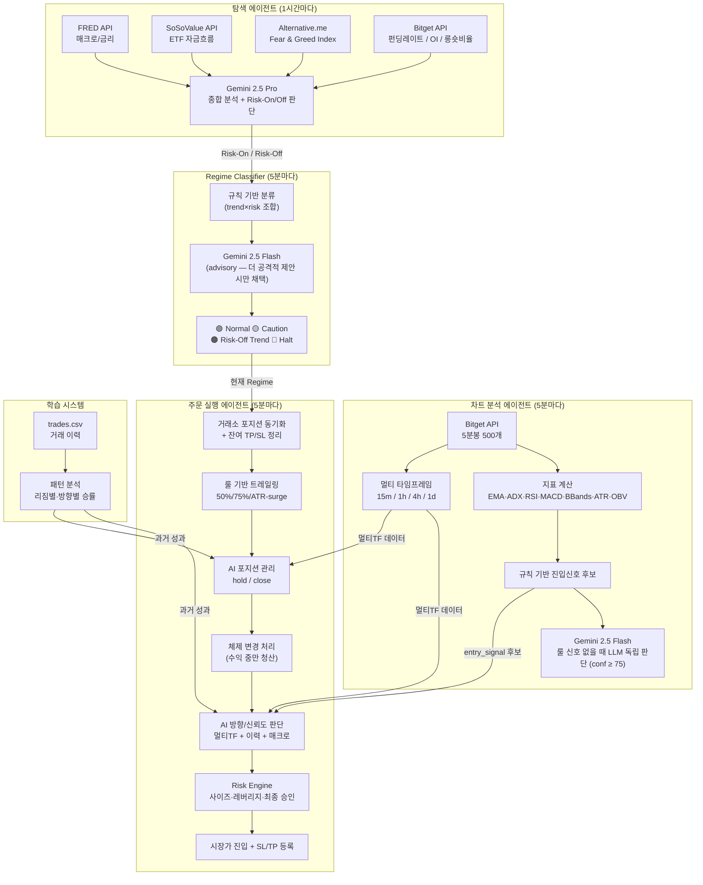

# 코인 선물 자동매매 AI Agent

BTC/USDT 무기한 선물 자동매매 시스템 — Bitget 데모 UTA, Gemini 2.5 기반

**핵심 분업**:
- **AI(Gemini)** — 방향(direction) + 신뢰도(confidence)만 결정
- **Risk Engine** — 사이즈 / 레버리지 / 최종 진입 승인 / 가드레일 전담
- **룰 기반 트레일링** — 진행률 기반 SL 자동 이동 (이익 보호)

> 목표: 수익 극대화보다 **MDD 관리 + 장기 생존성**

---

## 시스템 아키텍처



---

## 의사결정 흐름

```
Chart 룰 ──→ entry_signal 후보 (없으면 LLM 독립 신호로 보강)
                              ↓
              AI(Gemini Flash) ─→ direction + confidence
                              ↓ (confidence ≥ 70)
              Risk Engine     ─→ 사이즈·레버리지·필터 검사
                              ↓ (전 항목 통과)
                            시장가 진입 + SL/TP 등록
```

- **AI 신뢰도 < 70** → 진입하지 않음
- **AI 실패 시** → 룰 기반 신호로 폴백 (confidence = 70)
- **사이즈·레버리지는 AI가 결정하지 않음** — Risk Engine 전담

---

## Regime 상태 & 전략

| 상태 | 조합 | 전략 | 레버리지 (롱/숏) |
|------|------|------|---------|
| 🟢 Normal | Trend + Risk-On | EMA Pullback (추세 추종) | 5x / 3x |
| 🟡 Caution | Range + Risk-On | BBands Mean Reversion | 3x / 2x |
| 🟠 Risk-Off Trend | Trend + Risk-Off | 숏만 허용 | — / 2x |
| 🔴 Halt | Range + Risk-Off | 거래 중단 | — |

> 모든 포지션은 **Isolated Margin** 전용.

---

## 상태별 룰 기반 진입 신호

### 🟢 Normal — EMA Pullback (추세 추종)
```
Long (OR):
  - EMA20 > EMA50 AND 가격 ≤ EMA20×1.005 AND RSI 25~75
  - EMA20 > EMA50 AND RSI > 50 AND MACD hist > 0  (모멘텀)
Short:
  - EMA20 < EMA50

SL: ATR × 1.5    TP: ATR × 3.0
```

### 🟡 Caution — BBands Mean Reversion (평균 회귀)
```
Short (OR):  가격 ≥ BB상단 × 0.990  또는  RSI ≥ 75
Long  (OR):  가격 ≤ BB하단 × 1.010  또는  RSI ≤ 25

SL: ATR × 1.0    TP: ATR × 2.0
```

### 🟠 Risk-Off Trend — 숏만 허용
```
EMA20 < EMA50 → 숏 (롱 완전 금지)

SL: ATR × 1.0    TP: ATR × 2.0
```

### 🔴 Halt — 거래 중단
```
신규 진입 완전 금지 — 룰/AI 모두 무시
기존 포지션은 룰 기반 트레일링 + AI 판단으로 처리
```

### LLM 독립 신호 (룰이 'none'일 때만)
```
조건:  Gemini Flash가 직접 차트 평가 → confidence ≥ 75
효과:  entry_signal 을 long/short 로 덮어쓰기 (참고용)
제약:  risk-off + trend 일 때 long 신호는 차단
```

---

## Gemini AI 역할

| 용도 | 모델 | 동작 방식 |
|------|------|----------|
| 탐색 에이전트 보고서 | gemini-2.5-pro | Risk-On/Off 최종 판단 |
| 차트 신호 검증 | gemini-2.5-flash | 룰 기반 신호 신뢰도 점수 (참고용) |
| 차트 LLM 독립 신호 | gemini-2.5-flash | 룰 신호 없을 때 독립 판단 (conf ≥ 75 시 채택) |
| Regime 리뷰 | gemini-2.5-flash | **더 공격적 Regime만 채택**, 보수적 제안은 무시 |
| **방향/신뢰도 판단** | gemini-2.5-flash | 멀티TF + 이력 + 매크로 → direction + confidence |
| **포지션 관리** | gemini-2.5-flash | 열린 포지션별 hold / close 판단 (default = hold) |

> AI는 방향과 신뢰도만 결정. **레버리지·사이즈·최종 승인은 Risk Engine 담당.**

---

## 멀티 타임프레임 분석

매 5분 사이클마다 4개 타임프레임의 지표를 동시 수집:

| 타임프레임 | 수집 지표 |
|-----------|----------|
| 15m | EMA 20/50/200, ADX, RSI, MACD, BBands, ATR |
| 1h | 동일 (avg_atr 기준선으로 사용) |
| 4h | 동일 |
| 1d | 동일 |

**AI 판단 가이드라인:**
- 3개 이상 타임프레임 방향 일치 → 강한 진입
- 2개 일치 → 보통
- 불일치 → hold

---

## 과거 거래 학습

`trades.csv` 최근 20건을 AI에 자동 전달:

- **리짐별 통계** — normal에서 승률 80%, caution에서 30% 등
- **방향별 통계** — long PnL +500, short PnL -200 등
- **최근 5건 상세** — 닫힌 조건 / 사유 / 레버리지

→ AI가 "short은 최근 계속 지고 있으니 피하자" 같은 판단 가능

---

## 주문 방식

```
진입:   시장가 (Market Order)
         → 격리(Isolated) 강제 + set-leverage API 선행 호출
SL:     거래소 TPSL 주문 (mark_price 트리거)
         실패 3회 → 긴급 시장가 청산
TP:     거래소 TPSL 주문 (mark_price 트리거)
         실패 시 봇 자체 가격 체크 폴백 (check_tp_hits)
청산:   시장가 (Market Order)
재시도: 주문 실패 시 최대 3회 retry

mark price 충돌(45122/40917) 자동 처리:
  - 응답 msg에서 mark price 파싱 → SL을 0.05% 안쪽으로 조정 후 재시도

TP/SL 체결 시:
  - reconcile_closed_positions 가 거리(distance) 기반으로 TP/SL 판정
  - Bitget 히스토리 API로 실제 청산가/PnL 조회 (실패 시 추정)
  - 남은 반대쪽 TPSL 주문 자동 취소
```

---

## 룰 기반 동적 트레일링 스탑 (`adjust_positions_dynamic`)

매 5분 사이클마다 열린 포지션의 진행률을 평가:

| 진행률 | 동작 |
|--------|------|
| **TP 50% 도달** | SL을 손익분기점(entry + ATR×0.1)으로 이동 |
| **TP 75% 도달** | SL을 미실현 이익의 50% 잠금 위치로 이동 |
| **ATR 서지 (현재 > 진입 ATR×1.5)** | SL 30% 강화 (entry 쪽으로 70% 이동) |

> SL은 항상 현재가 0.05% 안쪽으로 클램프 (mark price 충돌 방지)
> 같은 사이클 내 50%/75% 블록이 SL을 이미 갱신했어도 ATR 서지 블록은 최신 sl 값으로 재평가

---

## AI 포지션 관리 (`ai_manage_positions`)

매 5분 사이클마다 AI가 멀티TF + 최근 이력 기반으로 평가:

| AI 판단 | 동작 |
|---------|------|
| **hold** (default) | 현재 TP/SL 유지 |
| **close** | 즉시 시장가 청산 (close_reason = "AI_CLOSE") |

> AI는 **hold가 기본값**. 명백한 3+ TF 역전 시에만 close.
> tighten_sl 옵션은 제거됨 — SL 조정은 룰 기반 트레일링이 담당.

---

## 체제 변경 시 포지션 처리 (`handle_regime_change`)

```
HALT 전환 (NORMAL→HALT, CAUTION→HALT, RISK_OFF→HALT, NORMAL→RISK_OFF):
  - 수익 중 포지션 → 즉시 시장가 청산 (수익 실현)
  - 손실 중 포지션 → 트레일링/AI 판단에 위임 (강제 청산 없음)

기타 전환 (예: NORMAL→CAUTION):
  - 별도 액션 없음 (트레일링 로직이 담당)

Idempotency:
  - 동일 transition 30분 내 재처리 차단 (last_transition_at 기반)
```

---

## Risk Engine (`src/risk_engine.py`) — 최종 진입 승인 게이트

AI가 enter_long/enter_short를 결정하더라도, 아래 검사를 **모두 통과해야** 진입:

```
1. check_daily_loss_pct       일일 손실 ≥ -5% (초기 잔고 기준) → 차단
2. check_consecutive_loss_cooldown
                              4연패 + 마지막 진입 후 2h 미만 → 차단
3. check_trend_filter         1h + 4h 모두 역방향 → 차단
4. check_event_filter         data/events.json 차단 일정 → 차단
                              (CPI/FOMC/NFP 기본 차단은 비활성 — AI 판단 위임)
5. check_max_exposure         총 노셔널 (size×lev 합) > 잔고 × 100% → 차단
```

### 포지션 사이징 (`calc_position_size`)
```
base       = balance × 10%
clamp      = max(500, min(base, 3000))            # 500 ~ 3000 USDT
ATR 감산   = avg_atr < atr 이면 ratio = avg_atr/atr 만큼 축소 (최대 -50%)
최종       = max(500, min(축소된 base, 3000))
```
> `avg_atr`은 **1h ATR**을 사용 (15m ATR이 1h보다 크면 변동성 급등으로 판단)

### 레버리지 (`cap_leverage`)
```
(normal, long)         → 5x
(normal, short)        → 3x
(caution, long)        → 3x
(caution, short)       → 2x
(risk_off_trend, short)→ 2x
그 외                  → 1x (사실상 진입 불가)
```

---

## 추가 가드레일 (executor 자체)

```
MAX_POSITIONS = 2          # 동시 포지션 최대 개수 (거래소 직접 검증)
같은 방향 중복 차단         # 거래소에 이미 long이면 long 진입 보류
최소 가용 증거금 = 500 USDT # 미만 시 관망
체결 폴링 = 18초 / 3초 간격 # 실패 시 거래소 포지션 직접 조회 폴백
```

> 진입 쿨다운 / Post-SL 재진입 차단은 **제거됨** (AI 판단에 위임)

---

## 내결함성

```
- 전체 try/except 래핑 — 어떤 에러도 프로세스 종료 없음
- Watchdog 스레드 — 12분 heartbeat, 무응답 시 스케줄러 재시작 (최대 3회)
- 거래소 포지션 동기화 — 재시작 후 미추적 포지션 자동 흡수 + SL/TP 등록
                        (ATR=0이면 SL/TP 등록 스킵)
- state.json — 매 사이클 Regime/신호/멀티TF 저장 (atomic write)
- system.log — stdout/stderr 전체 타임스탬프 prefix tee
- AI 실패 시 — 진입: 룰 기반 폴백 (conf=70) / 포지션: 전체 hold
- TP/SL 체결 후 — 잔여 주문 자동 취소 (새 포지션 방해 방지)
- 차트 연속 실패 3회 — entry_signal 강제 'none' 초기화
- state.json stale (10분 초과) — fail-safe halt 전환
```

---

## 대시보드

```
실행:  uv run python dashboard.py
URL:   http://localhost:52090

기능:
  - 실시간 BTC 가격 (Bitget API, 3초 갱신)
  - 24시간 변동률
  - Regime 상태 / 포트폴리오 / 미실현 손익
  - RSI / ADX / Fear & Greed 게이지
  - 누적 PnL 차트
  - 현재 포지션 테이블
  - 매크로 지표 (금리, ETF, 펀딩레이트, OI, 롱숏비율)
  - 시스템 로그 (최근 100줄)
```

---

## 기술 스택

| 분류 | 라이브러리 |
|------|-----------|
| LLM | google-genai (gemini-2.5-pro / flash) |
| 거래소 | Bitget REST API (데모 UTA) |
| 스케줄링 | APScheduler |
| 데이터 | pandas, numpy |
| 지표 | pandas-ta |
| 대시보드 | FastAPI + Chart.js |
| 환경변수 | python-dotenv |

---

## 파일 구조

```
src/
  ai_brain.py       # AI 방향/신뢰도 판단 (진입/포지션 관리)
  risk_engine.py    # Risk Engine (레버리지·사이징·최종 승인·필터)
  chart.py          # 차트 분석 + 멀티 타임프레임 수집 + LLM 독립 신호
  regime.py         # Regime 분류 (Gemini 리뷰)
  executor.py       # 주문 실행 + 트레일링 + 동기화 + 체제 변경 처리
  explorer.py       # 매크로 분석 + 스케줄러 (메인 엔트리)
  models.py         # 데이터 모델
  client.py         # Bitget 클라이언트
  gemini.py         # Gemini 모델 인스턴스
  ws_monitor.py     # WebSocket 모니터 (데몬)
  watchdog.py       # Watchdog 스레드
dashboard.py        # FastAPI 대시보드 서버
dashboard/
  index.html        # 대시보드 UI
data/
  state.json        # 상태 (Regime, 신호, 멀티TF)
  positions.json    # 포지션 추적 (last_transition / last_entry_at / last_sl_at)
  daily.json        # 일일 통계 (KST 기준 daily reset)
  trades.csv        # 거래 이력
  portfolio.json    # 포트폴리오 스냅샷
  explorer_report.json # 매크로 분석 결과
  system.log        # 시스템 로그
  events.json       # (선택) 차단 이벤트 일정
```

---

## 환경 설정

```env
BITGET_API_KEY=
BITGET_SECRET_KEY=
BITGET_PASSPHRASE=
BITGET_IS_DEMO=True

# Gemini API 키 또는 Vertex AI ADC 중 택1
GEMINI_API_KEY=
GOOGLE_APPLICATION_CREDENTIALS=/path/to/service-account.json

FRED_API_KEY=
SOSOVALUE_API_KEY=
```

---

## 실행

```bash
uv sync
uv run python main.py        # 메인 트레이딩 봇 (explorer 진입점)
uv run python dashboard.py   # 대시보드 (별도 터미널)
```

---

## 스케줄

| 작업 | 주기 |
|------|------|
| Explorer (매크로 분석 + Risk-On/Off) | 1시간 |
| Chart + Regime + Executor 체인 | 5분 |
| 대시보드 가격 갱신 | 3초 |
| Watchdog heartbeat | 12분 |

---

## 핵심 상수 (코드 동기화)

| 상수 | 값 | 위치 |
|------|----|------|
| `INITIAL_BALANCE` | 19,293 USDT | `risk_engine.py`, `executor.py` |
| `DAILY_LOSS_PCT` | -5% | `risk_engine.py` |
| `CONSECUTIVE_LOSS_COOLDOWN` | 4연패 / 2시간 | `risk_engine.py` |
| `MAX_POSITIONS` | 2 | `executor.py` |
| `_SIZE_MIN / _SIZE_MAX` | 500 / 3000 USDT | `risk_engine.py` |
| AI confidence threshold | 70 | `executor.py` |
| Fallback confidence | 70 | `ai_brain.py` |
| LLM 독립 신호 채택 | ≥ 75 | `chart.py` |
| Chart stale | 10분 | `chart.py` |
| Explorer stale | 120분 | `chart.py` |
| Watchdog heartbeat | 12분 | `explorer.py` |
