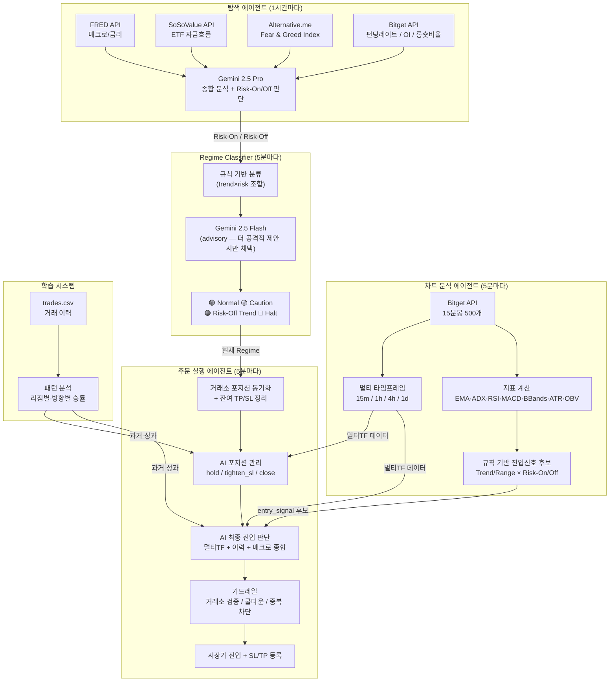

# 코인 선물 자동매매 AI Agent

BTC/USDT 무기한 선물 자동매매 시스템 — Bitget 데모 UTA, Gemini 2.5 기반

**핵심**: AI(Gemini)가 최종 의사결정자. 룰 기반 시스템은 후보 생성 + 안전 가드레일.

---

## 시스템 아키텍처



---

## 의사결정 흐름

```
Chart 룰 ──→ 후보 신호 생성 ──→ AI가 전체 컨텍스트 종합 판단 ──→ 실행
                                      ↑
              멀티 TF (15m/1h/4h/1d) ──┤
              과거 거래 이력 (20건) ────┤
              매크로 + Risk 판단 ───────┤
              현재 보유 포지션 ─────────┘
```

- **AI 신뢰도 < 70**: 진입하지 않음
- **AI 실패 시**: 룰 기반 신호로 폴백 (confidence=60)

---

## Regime 상태 & 전략

| 상태 | 조합 | 전략 | 레버리지 |
|------|------|------|---------|
| 🟢 Normal | Trend + Risk-On | EMA Pullback (추세 추종) | 롱 10x / 숏 5x |
| 🟡 Caution | Range + Risk-On | BBands Mean Reversion | 롱 5x / 숏 3x |
| 🟠 Risk-Off Trend | Trend + Risk-Off | 숏만 허용 | 숏 3x |
| 🔴 Halt | Range + Risk-Off | 거래 중단 | — |

---

## 상태별 전략 상세

### 🟢 Normal — EMA Pullback (추세 추종)

```
진입 조건 (OR) — 룰 기반 후보 생성, AI가 최종 판단:
  - EMA20 > EMA50 AND 가격 ≤ EMA20×1.005 AND RSI 25~75  → 롱
  - EMA20 > EMA50 AND RSI > 50 AND MACD hist > 0         → 롱 (모멘텀)
  - EMA20 < EMA50                                         → 숏

레버리지:  롱 5x / 숏 3x
SL:        ATR × 1.5
TP:        ATR × 3.0
```

### 🟡 Caution — BBands Mean Reversion (평균 회귀)

```
진입 조건 (OR):
  - 가격 ≥ BB 상단 × 0.990 또는 RSI ≥ 70  → 숏
  - 가격 ≤ BB 하단 × 1.010 또는 RSI ≤ 30  → 롱

레버리지:  롱 3x / 숏 2x
SL:        ATR × 1.0
TP:        ATR × 2.0
```

### 🟠 Risk-Off Trend — 숏만 허용

```
진입 조건:  EMA20 < EMA50  → 숏 (롱 완전 금지)

레버리지:  숏 2x
SL:        ATR × 1.0
TP:        ATR × 2.0
```

### 🔴 Halt — 거래 중단

```
신규 진입:       완전 금지
기존 포지션 SL:  ATR × 0.8 로 타이트하게 조정
```

---

## Gemini AI 역할

| 용도 | 모델 | 동작 방식 |
|------|------|----------|
| 탐색 에이전트 보고서 | gemini-2.5-pro | Risk-On/Off 최종 판단 |
| 차트 신호 검증 | gemini-2.5-flash | 룰 기반 신호 점수 부여 (참고용) |
| 차트 LLM 독립 신호 | gemini-2.5-flash | 규칙 기반 no signal 시 독립 판단 (conf ≥ 75 시 채택) |
| Regime 리뷰 | gemini-2.5-flash | 더 공격적 Regime 제안 시만 채택, 보수적 무시 |
| **방향/신뢰도 판단** | gemini-2.5-flash | 멀티TF + 이력 + 매크로 → direction + confidence 결정 |
| **포지션 관리** | gemini-2.5-flash | 열린 포지션별 hold / tighten_sl / close 결정 |

> AI는 **방향과 신뢰도만** 결정. 레버리지·사이즈·최종 승인은 **Risk Engine** 담당.

---

## 멀티 타임프레임 분석

매 5분 사이클마다 4개 타임프레임의 지표를 동시 수집:

| 타임프레임 | 수집 지표 |
|-----------|----------|
| 15m | EMA 20/50/200, ADX, RSI, MACD, BBands, ATR |
| 1h | 동일 |
| 4h | 동일 |
| 1d | 동일 |

**AI 판단 기준:**
- 3개 이상 타임프레임 방향 일치 → 강한 진입 신호
- 2개 일치 → 보통
- 불일치 → hold (진입 안 함)

---

## 과거 거래 학습

`trades.csv`에서 최근 20건을 분석하여 AI에 전달:

- **리짐별 통계**: normal에서 승률 80%, caution에서 승률 30% 등
- **방향별 통계**: long PnL +500, short PnL -200 등
- **최근 5건 상세**: 어떤 조건에서 어떻게 닫혔는지

→ AI가 "short은 최근 계속 지고 있으니 피하자" 같은 판단 가능

---

## 주문 방식

```
진입:   시장가 (Market Order)
        → 레버리지 set-leverage API 선행 호출
청산:   시장가 (Market Order)
SL:     거래소 TPSL 주문 (실패 3회 → 긴급 시장가 청산)
TP:     거래소 TPSL 주문 (실패 시 봇 자체 가격 체크 폴백)
재시도: 주문 실패 시 최대 3회 retry

TP/SL 체결 시: 남은 반대쪽 주문 자동 취소
```

---

## Regime 변경 시 포지션 처리

```
🟢/🟡 → 🔴 또는 🟢 → 🟠  :
  수익 중  → 즉시 시장가 청산 (수익 실현)
  손실 중  → SL을 ATR×0.8로 타이트하게 조정 후 유지

🟢 → 🟡  :
  SL을 ATR×0.8로 타이트하게 조정 후 유지
```

---

## AI 포지션 관리 (동적 TP/SL)

매 5분 사이클마다 AI가 열린 포지션을 멀티TF 기반으로 평가:

| AI 판단 | 동작 |
|---------|------|
| **hold** | 현재 TP/SL 유지 |
| **tighten_sl** | SL을 지정 가격으로 이동 (이익 보호) |
| **close** | 즉시 시장가 청산 |

판단 근거: 상위 타임프레임 추세 전환, 모멘텀 약화, 변동성 급증 등

---

## 리스크 관리 (Risk Engine)

```
포지션 사이징  : ATR 기반 자동 조절, 500~1,500 USDT 범위
                고변동성 → 최대 50% 감산
레버리지      : Isolated only (normal 5x, caution 3x, risk_off 2x)
동시 포지션    : 최대 2개 (거래소 직접 검증)
같은 방향 중복 : 차단
진입 쿨다운    : 15분
Max Exposure   : 총 노셔널 ≤ 잔고 100%
일일 최대 손실 : -5% (초기 잔고 기준)
최소 잔고      : 500 USDT 미만 시 관망

연패 보호      : 4연패 → 2시간 쿨다운
SL 후 보호     : SL 직후 같은 방향 30분 재진입 차단
추세 필터      : 1h+4h 모두 역방향이면 진입 차단
이벤트 필터    : FOMC/CPI/NFP 전후 신규 진입 차단

자동 중단      : 일일 손실 한도 또는 연패 보호 발동 시
               → 프로세스는 유지, 거래만 중단
```

---

## 내결함성

```
- 전체 try/except 래핑 — 어떤 에러도 프로세스 종료 없음
- Watchdog 스레드 — 12분 heartbeat, 무응답 시 스케줄러 재시작 (최대 3회)
- 거래소 포지션 동기화 — 재시작 후 미추적 포지션 자동 흡수 + SL/TP 등록
- state.json — 매 사이클 Regime/신호/멀티TF 저장, 재시작 시 복구
- system.log — stdout/stderr 전체 타임스탬프 기록
- AI 실패 시 — 진입: 룰 기반 폴백 / 포지션: 전체 hold
- TP/SL 체결 후 — 잔여 주문 자동 취소 (새 포지션 방해 방지)
```

---

## 대시보드

```
실행:  uv run python dashboard.py
URL:   http://localhost:52090

기능:
  - 실시간 BTC 가격 (Bitget API, 3초 갱신)
  - 24시간 변동률
  - Regime 상태 / 포트폴리오 / 미실현 손익
  - RSI / ADX / Fear & Greed 게이지
  - 누적 PnL 차트
  - 현재 포지션 테이블
  - 매크로 지표 (금리, ETF, 펀딩레이트, OI, 롱숏비율)
  - 시스템 로그 (최근 100줄)
```

---

## 기술 스택

| 분류 | 라이브러리 |
|------|-----------|
| LLM | google-genai (gemini-2.5-pro / flash) |
| 거래소 | Bitget REST API (데모 UTA) |
| 스케줄링 | APScheduler |
| 데이터 | pandas, numpy |
| 지표 | pandas-ta |
| 대시보드 | FastAPI + Chart.js |
| 환경변수 | python-dotenv |

---

## 파일 구조

```
src/
  ai_brain.py      # AI 방향/신뢰도 판단 (진입/포지션 관리)
  risk_engine.py    # Risk Engine (레버리지·사이징·최종 승인·필터)
  chart.py          # 차트 분석 + 멀티 타임프레임 수집
  regime.py         # Regime 분류 (Gemini 리뷰)
  executor.py       # 주문 실행 + 리스크 관리
  explorer.py       # 매크로 분석 + 스케줄러 (메인 엔트리)
  models.py         # 데이터 모델
  client.py         # Bitget 클라이언트
  gemini.py         # Gemini 모델 인스턴스
  ws_monitor.py     # WebSocket 모니터 (데몬)
  watchdog.py       # Watchdog 스레드
dashboard.py        # FastAPI 대시보드 서버
dashboard/
  index.html        # 대시보드 UI
data/
  state.json        # 상태 (Regime, 신호, 멀티TF)
  positions.json    # 포지션 추적
  daily.json        # 일일 통계
  trades.csv        # 거래 이력
  portfolio.json    # 포트폴리오 스냅샷
  system.log        # 시스템 로그
```

---

## 환경 설정

```env
BITGET_API_KEY=
BITGET_SECRET_KEY=
BITGET_PASSPHRASE=
BITGET_IS_DEMO=True

# Gemini API 키 또는 Vertex AI ADC 중 택1
GEMINI_API_KEY=
GOOGLE_APPLICATION_CREDENTIALS=/path/to/service-account.json

FRED_API_KEY=
SOSOVALUE_API_KEY=
```

---

## 실행

```bash
uv sync
uv run python main.py        # 메인 트레이딩 봇
uv run python dashboard.py   # 대시보드 (별도 터미널)
```

---

## 스케줄

| 작업 | 주기 |
|------|------|
| Explorer (매크로 분석) | 1시간 |
| Chart + Regime + Executor | 5분 |
| 대시보드 가격 갱신 | 3초 |
| Watchdog heartbeat | 12분 |
