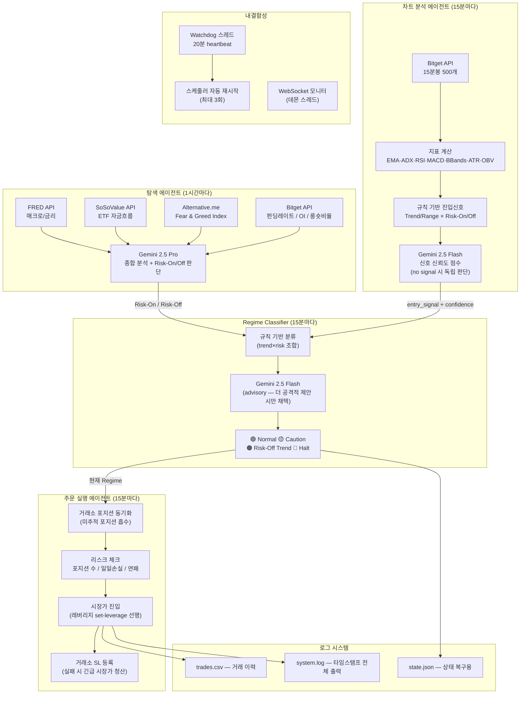

# 코인 선물 자동매매 AI Agent

BTC/USDT 무기한 선물 자동매매 시스템 — Bitget 데모 UTA, Gemini 2.5 기반

---

## 시스템 아키텍처



---

## Regime 상태 & 전략

| 상태 | 조합 | 전략 | 레버리지 |
|------|------|------|---------|
| 🟢 Normal | Trend + Risk-On | EMA Pullback (추세 추종) | 롱 10x / 숏 5x |
| 🟡 Caution | Range + Risk-On | BBands Mean Reversion | 롱 5x / 숏 3x |
| 🟠 Risk-Off Trend | Trend + Risk-Off | 숏만 허용 | 숏 3x |
| 🔴 Halt | Range + Risk-Off | 거래 중단 | — |

---

## 상태별 전략 상세

### 🟢 Normal — EMA Pullback (추세 추종)

```
진입 조건 (OR):
  - EMA20 > EMA50 AND 가격 ≤ EMA20×1.005 AND RSI 25~75  → 롱
  - EMA20 > EMA50 AND RSI > 50 AND MACD hist > 0         → 롱 (모멘텀)
  - EMA20 < EMA50                                         → 숏

레버리지:  롱 10x / 숏 5x
SL:        ATR × 1.5
TP:        ATR × 3.0
```

### 🟡 Caution — BBands Mean Reversion (평균 회귀)

```
진입 조건 (OR):
  - 가격 ≥ BB 상단 × 0.990 또는 RSI ≥ 70  → 숏
  - 가격 ≤ BB 하단 × 1.010 또는 RSI ≤ 30  → 롱

레버리지:  롱 5x / 숏 3x
SL:        ATR × 1.0
TP:        ATR × 2.0
```

### 🟠 Risk-Off Trend — 숏만 허용

```
진입 조건:  EMA20 < EMA50  → 숏 (롱 완전 금지)

레버리지:  숏 3x
SL:        ATR × 1.0
TP:        ATR × 2.0
```

### 🔴 Halt — 거래 중단

```
신규 진입:       완전 금지
기존 포지션 SL:  ATR × 0.8 로 타이트하게 조정
```

---

## Gemini 역할

| 용도 | 모델 | 동작 방식 |
|------|------|----------|
| 탐색 에이전트 보고서 | gemini-2.5-pro | Risk-On/Off 최종 판단 |
| 차트 신호 신뢰도 | gemini-2.5-flash | 0~100 점수 반환 (참고용) |
| 차트 LLM 독립 신호 | gemini-2.5-flash | 규칙 기반 no signal 시 독립 판단 (confidence ≥ 75 시 채택) |
| Regime 리뷰 | gemini-2.5-flash | 더 공격적 Regime 제안 시만 채택, 보수적 제안은 무시 |

> 주문 실행은 규칙 기반으로만 동작. Gemini가 주문을 직접 승인·거부하지 않음.

---

## 주문 방식

```
진입:   시장가 (Market Order)
        → 레버리지 set-leverage API 선행 호출
청산:   시장가 (Market Order)
SL:     거래소 TPSL 주문 (실패 3회 → 긴급 시장가 청산)
TP:     executor 자체 가격 체크 → 시장가 청산
재시도: 주문 실패 시 최대 3회 retry
```

---

## Regime 변경 시 포지션 처리

```
🟢/🟡 → 🔴 또는 🟢 → 🟠  :
  수익 중  → 즉시 시장가 청산 (수익 실현)
  손실 중  → SL을 ATR×0.8로 타이트하게 조정 후 유지

🟢 → 🟡  :
  SL을 ATR×0.8로 타이트하게 조정 후 유지
```

---

## 리스크 관리 규칙

```
1회 거래금액   : min(2,000 USDT, 잔고 × 10%)
동시 포지션    : 최대 2개
일일 최대 손실 : 1,500 USDT
초기 자산      : 20,000 USDT (데모)

자동 중단      : 3연패 또는 일일 손실 한도 도달 시
               → 프로세스는 유지, 거래만 중단
```

---

## 내결함성

```
- 전체 try/except 래핑 — 어떤 에러도 프로세스 종료 없음
- Watchdog 스레드 — 20분 heartbeat, 무응답 시 스케줄러 재시작 (최대 3회)
- 거래소 포지션 동기화 — 재시작 후 미추적 포지션 자동 흡수
- state.json — 매 사이클 Regime/신호 저장, 재시작 시 복구
- system.log — stdout/stderr 전체 타임스탬프 기록
```

---

## 기술 스택

| 분류 | 라이브러리 |
|------|-----------|
| LLM | google-genai (gemini-2.5-pro / flash) |
| 거래소 | Bitget REST API (데모 UTA) |
| 스케줄링 | APScheduler |
| 데이터 | pandas, numpy |
| 지표 | pandas-ta |
| 환경변수 | python-dotenv |

---

## 환경 설정

```env
BITGET_API_KEY=
BITGET_SECRET_KEY=
BITGET_PASSPHRASE=
BITGET_IS_DEMO=True

# Gemini API 키 또는 Vertex AI ADC 중 택1
GEMINI_API_KEY=
GOOGLE_APPLICATION_CREDENTIALS=/path/to/service-account.json

FRED_API_KEY=
SOSOVALUE_API_KEY=
```

---

## 실행

```bash
uv sync
uv run python main.py
```

---

## 개발 단계

- [x] 1단계: Bitget 데모 API 연결 및 잔고 조회
- [x] 2단계: 탐색 에이전트 (매크로/ETF/심리 + Gemini 분석)
- [x] 3단계: 차트 분석 에이전트 (지표 + Gemini 판단)
- [x] 4단계: Regime Classifier
- [x] 5단계: 리스크 관리 + 주문 실행
- [x] 6단계: 내결함성 (Watchdog + 상태 복구)
- [x] 7단계: 로그 시스템
- [x] 8단계: 전체 통합 및 데모 테스트

---

## 대회 정보

- 마감: **2025.05.15(금) 15:00**
- 거래소: Bitget 데모 (모의거래)
- 평가: 마감 시점 수익률 (보유 포지션 현재가 환산)
- 필수: `trades.csv` 거래 이력 보관
