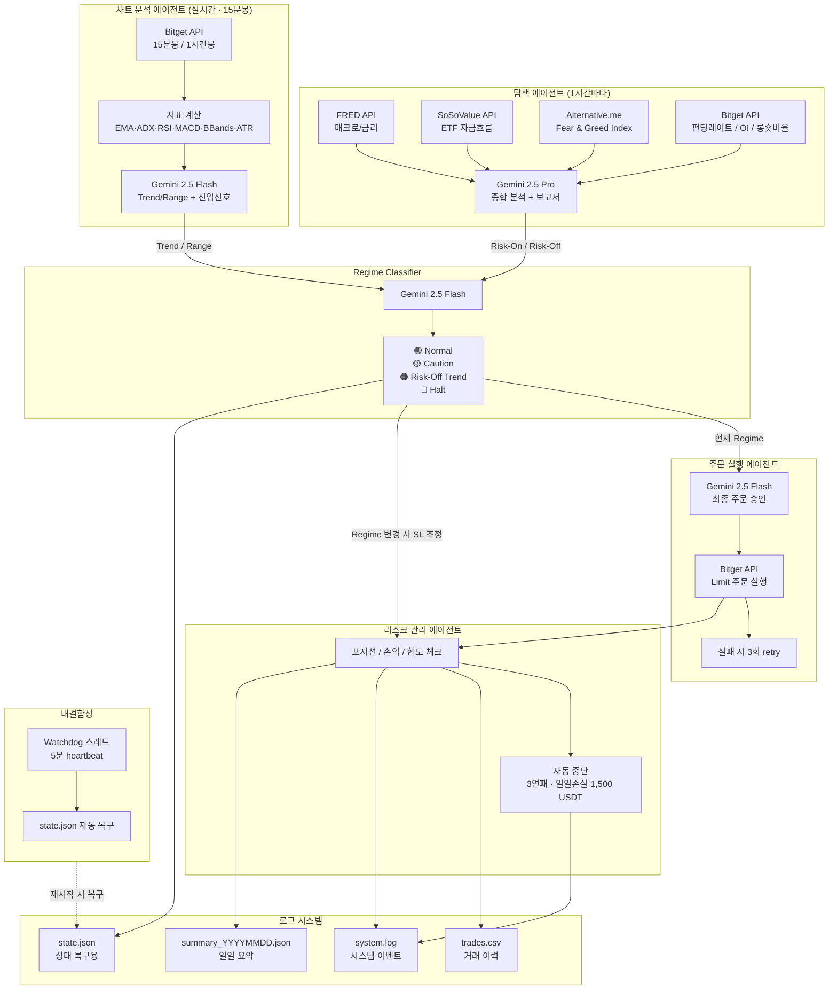

# 코인 선물 자동매매 AI Agent

BTC/USDT 무기한 선물 자동매매 시스템 — Bitget 데모 UTA, Gemini 2.5 기반

---

## 시스템 아키텍처



---

## Regime 상태 & 전략

| 상태 | 조합 | 전략 | 레버리지 |
|------|------|------|---------|
| 🟢 Normal | Trend + Risk-On | EMA Pullback (추세 추종) | 롱 5x / 숏 3x |
| 🟡 Caution | Range + Risk-On | BBands Mean Reversion | 롱 3x / 숏 2x |
| 🟠 Risk-Off Trend | Trend + Risk-Off | 숏만 허용 | 숏 2x |
| 🔴 Halt | Range + Risk-Off | 거래 중단 | — |

---

## 상태별 전략 상세

### 🟢 Normal — EMA Pullback (추세 추종)
```
진입 조건:
  - EMA20 > EMA50 > EMA200 (완전 정배열)
  - 가격이 EMA20 ~ EMA50 사이로 눌림목
  - RSI 40 ~ 60 구간에서 반등
  - ADX > 25

레버리지:  롱 5x / 숏 3x
SL:        ATR × 1.5
TP:        ATR × 3.0
```

### 🟡 Caution — BBands Mean Reversion (평균 회귀)
```
진입 조건:
  - ADX < 20 (강제)
  - BB Width 감소 상태
  - 가격이 BB 상단/하단 터치

레버리지:  롱 3x / 숏 2x
SL:        ATR × 1.0
TP:        ATR × 2.0
```

### 🟠 Risk-Off Trend — 숏만 허용
```
레버리지:  숏 2x
SL:        ATR × 1.0
TP:        ATR × 2.0
롱:        완전 금지
```

### 🔴 Halt — 거래 중단
```
신규 진입:       완전 금지
기존 포지션 SL:  ATR × 0.8 로 타이트하게 조정
```

---

## Regime 변경 시 포지션 처리

```
🟢 → 🟡  :  SL을 ATR×0.8로 타이트하게 조정 후 유지
🟢 → 🔴  :  수익 중  → 즉시 시장가 청산 (수익 실현)
             손실 중  → SL을 ATR×0.8로 타이트하게 조정 후 유지
```

---

## Gemini 모델 사용 전략

| 용도 | 모델 | 주기 |
|------|------|------|
| 탐색 에이전트 보고서 | gemini-2.5-pro | 1시간마다 |
| 차트 신호 판단 | gemini-2.5-flash | 실시간 |
| Regime 분류 | gemini-2.5-flash | 실시간 |
| 주문 최종 승인 | gemini-2.5-flash | 거래 시마다 |
| 비상 정지 판단 | gemini-2.5-flash | 실시간 |

---

## 리스크 관리 규칙

```
1회 거래금액   : 2,000 USDT
동시 포지션    : 최대 2개
일일 최대 손실 : 1,500 USDT
초기 자산      : 20,000 USDT (데모)

자동 중단      : 3연패 또는 일일 손실 한도 도달 시
               → 프로세스는 유지, 거래만 중단
```

---

## 기술 스택

| 분류 | 라이브러리 |
|------|-----------|
| LLM | google-genai (gemini-2.5-pro / flash) |
| 거래소 | Bitget REST API (데모 UTA) |
| 스케줄링 | APScheduler |
| 데이터 | pandas, numpy |
| 지표 | pandas-ta |
| 환경변수 | python-dotenv |

---

## 환경 설정

`.env.example` 참고:

```
BITGET_API_KEY=
BITGET_SECRET_KEY=
BITGET_PASSPHRASE=
BITGET_IS_DEMO=True

GEMINI_API_KEY=
```

---

## 개발 단계

- [x] 1단계: Bitget 데모 API 연결 및 잔고 조회
- [x] 2단계: 탐색 에이전트 (매크로/ETF/심리 + Gemini 분석)
- [x] 3단계: 차트 분석 에이전트 (지표 + Gemini 판단)
- [x] 4단계: Regime Classifier
- [x] 5단계: 리스크 관리 + 주문 실행
- [x] 6단계: 내결함성 (Watchdog + 상태 복구)
- [x] 7단계: 로그 시스템
- [x] 8단계: 전체 통합 및 데모 테스트

---

## 대회 정보

- 마감: **2025.05.15(금) 15:00**
- 거래소: Bitget 데모 (모의거래)
- 평가: 마감 시점 수익률 (보유 포지션 현재가 환산)
- 필수: `trades.csv` 거래 이력 보관
